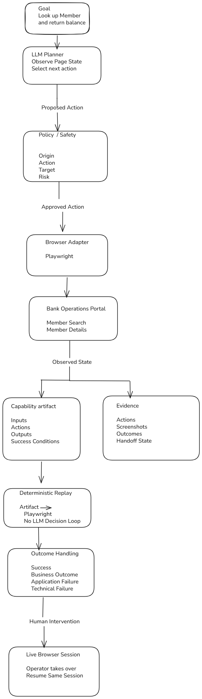

# Engineering Report

## 1. Architecture

The system is divided into workflow discovery, validation, capability storage, deterministic replay, and outcome handling.




### Architecture Components

The workflow starts with a member lookup goal and passes through a sequence of controlled browser operations.

The LLM Planner observes the current page state and selects the next action. The proposed action is then passed through the Policy and Safety layer, where the origin, action, target, and risk are checked before execution.

Approved actions are executed through the Playwright browser adapter against the Bank Operations Portal. The portal provides the Member Search and Member Details interfaces used by the workflow.

The resulting browser state is used to produce two types of information:

- The capability artifact, which stores the workflow inputs, actions, outputs, and success conditions.
- Execution evidence, which stores actions, screenshots, outcomes, and human handoff information.

The capability artifact is then used by the deterministic replay process. Replay executes the stored workflow through Playwright without repeating the action-selection process.

The final stage classifies the execution result as a success, business outcome, application failure, or technical failure.

When manual intervention is required, control can be transferred to an operator through the live browser session. The operator can complete the required action and execution can resume using the same browser session.

### Architecture Boundary

The main boundary in the system is between workflow discovery and deterministic replay.

During discovery, the workflow is determined from the current application state and stored as a capability artifact. During replay, the stored artifact becomes the execution contract and the workflow is executed directly.

This separation allows the same member lookup workflow to be reused with different member IDs while keeping the replay process consistent and easier to test.

## 2. Artifact Schema

The workflow discovered during execution is stored as a structured JSON capability artifact:

`artifacts/member_lookup_agent.json`

The artifact defines the information required to execute and validate the member lookup workflow.

### Artifact Structure

The artifact contains the following main sections:

| Field | Purpose |
|---|---|
| `artifact_version` | Identifies the version of the capability artifact |
| `capability` | Defines the capability name, description, and application surface |
| `inputs` | Defines the inputs required to execute the workflow |
| `actions` | Defines the ordered browser actions |
| `outputs` | Defines the values returned by the workflow |
| `success_condition` | Defines the conditions required for a successful execution |
| `known_outcomes` | Defines expected business and application failure outcomes |

### Capability

The current capability is:

`member_lookup`

Its purpose is to look up a bank member and return the member's savings balance.

The capability is associated with the web surface of the Bank Operations Portal.

### Input

The workflow requires one input:

```text
member_id

## 3. Determinism & Error Handling

The system separates workflow discovery from deterministic replay.

During discovery, the required browser actions are identified and stored in the capability artifact. During replay, the stored artifact is loaded and its actions are executed in the defined order.

This prevents the replay process from having to rediscover the workflow for every execution.

### Deterministic Replay

The replay process follows the stored action sequence:

```text
Capability Artifact
        |
        v
Replay Engine
        |
        v
Playwright
        |
        v
Bank Operations Portal
        |
        v
Verification
        |
        v
Output / Runtime Outcome

## 4. Heterogeneity & Multi-Tenant

The current implementation uses a web application and Playwright as the browser execution layer. Desktop automation and multiple tenant environments are not implemented in the current version, but the capability and replay design leaves a clear boundary for extending the system.

### Surface Abstraction

The capability artifact describes the workflow independently from the underlying surface.

For the current web application, actions such as:

```text
click
fill
verify
extract

## 5. Escalation & Handoff

The system provides a controlled path for transferring execution from automation to a human operator when the workflow cannot safely continue automatically.

### Detecting an Intervention State

During discovery, the system can enter an intervention state when a controlled human-handoff condition is triggered.

When intervention is required, the automation pauses before continuing with the workflow.

The system records:

- The current capability or goal
- The current execution step
- The current browser URL
- The reason for the intervention
- A screenshot of the current browser state

This information provides the operator with the context required to continue the workflow.

### Human Takes Control

The important part of the handoff is that the operator takes control of the existing browser session.

The browser is not closed and a new session is not created.

The flow is:

```text
Automation
    |
    v
Intervention Required
    |
    v
Pause Current Execution
    |
    v
Capture Browser State
    |
    v
Human Takes Control
    |
    v
Human Completes Required Action
    |
    v
Resume Automation
    |
    v
Continue Same Browser Session

## 6. Safety

The system uses a policy layer to validate browser actions before they are executed.

The purpose of the policy is to restrict execution to the intended application, actions, and targets rather than allowing unrestricted browser interaction.

### Origin Validation

Browser interaction is restricted to the approved application origin:

```text
http://127.0.0.1:8000

## 7. Cuts

The implementation intentionally focuses on one complete browser workflow rather than attempting to build a general automation platform.

The goal was to keep the core workflow working end to end while leaving clear boundaries for functionality that would require additional infrastructure.

### Desktop Automation

Desktop application support is not implemented in the current version.

The current implementation uses Playwright against the Bank Operations Portal.

A future version could introduce a separate execution adapter for desktop applications while keeping the capability definition independent from the surface used to execute it.

### Multi-Tenant Execution

The current implementation runs against a single local application and does not include distributed multi-tenant execution.

Tenant-specific execution isolation, credentials, browser sessions, and application configuration would be required for a larger deployment.

The current capability structure provides a starting point for separating shared workflow definitions from tenant-specific execution details.

### Capability Registry

Capabilities are currently stored as local JSON artifacts.

A larger implementation could replace local files with a versioned capability registry that supports:

- Capability review
- Versioning
- Promotion
- Rollback
- Reuse

A possible lifecycle would be:

```text
Discovery
   |
   v
Validation
   |
   v
Capability Registry
   |
   v
Versioned Execution